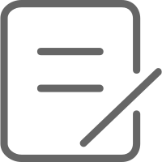
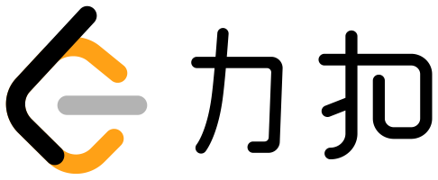
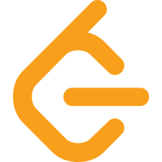
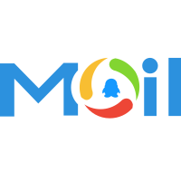
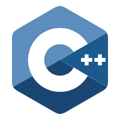
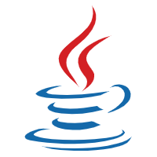
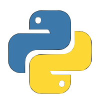
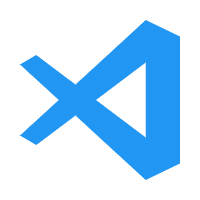
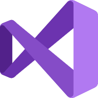

# Hi there,I'm [Neo Zhang](https://octopuslian.github.io/) 👋  

 
 

## 😄 About Me  

Hi, I'm Neo Zhang(Chinese name is Niannian Zhang), a loves programming back-end development engineer from China.  

- 🔭 I’m currently working on [Coursera-Sedgewick-Algorithms](https://github.com/OctopusLian/Coursera-Sedgewick-Algorithms)  
- 🌱 I’m currently learning algorithms and golang  
- 👯 I’m looking to receive a back-end development offer from a big factory in the spring recruitment or pass the Chinese graduate entrance examination  
- 🤔 I’m looking for help with who can help me push the big factories in China and abroad, thank you very much  
- 💬 Ask me about anything [here](https://github.com/OctopusLian/OctopusLian)  

**Languages and Tools:**  

<code></code>
<code></code>
<code></code>
<code></code>
<code></code>
<code></code>

*NOTE: Top languages does not indicate my skill level or something like that, it's a github metric of which languages i have the most code on github*

<a href="https://github.com/anuraghazra/github-readme-stats">
  <!-- Change the `github-readme-stats.anuraghazra1.vercel.app` to `github-readme-stats.vercel.app`  -->
  
</a>

<a href="https://github.com/OctopusLian/leetcode-solutions">
  <!-- Change the `github-readme-stats.anuraghazra1.vercel.app` to `github-readme-stats.vercel.app`  -->
  
</a>
<a href="https://github.com/OctopusLian/octopuslian.github.io">
  <!-- Change the `github-readme-stats.anuraghazra1.vercel.app` to `github-readme-stats.vercel.app`  -->
  
</a>

<a href="https://github.com/OctopusLian/lintcode-solutions">
  <!-- Change the `github-readme-stats.anuraghazra1.vercel.app` to `github-readme-stats.vercel.app`  -->
  
</a>

<a href="https://github.com/OctopusLian/nowcoder-solutions">
  <!-- Change the `github-readme-stats.anuraghazra1.vercel.app` to `github-readme-stats.vercel.app`  -->
  
</a>

<a href="https://github.com/OctopusLian/Coursera-Sedgewick-Algorithms">
  <!-- Change the `github-readme-stats.anuraghazra1.vercel.app` to `github-readme-stats.vercel.app`  -->
  
</a>

<!--
**OctopusLian/OctopusLian** is a ✨ _special_ ✨ repository because its `README.md` (this file) appears on your GitHub profile.

Here are some ideas to get you started:

- 🔭 I’m currently working on ...
- 🌱 I’m currently learning ...
- 👯 I’m looking to collaborate on ...
- 🤔 I’m looking for help with ...
- 💬 Ask me about ...
- 📫 How to reach me: ...
- 😄 Pronouns: ...
- ⚡ Fun fact: ...
-->

